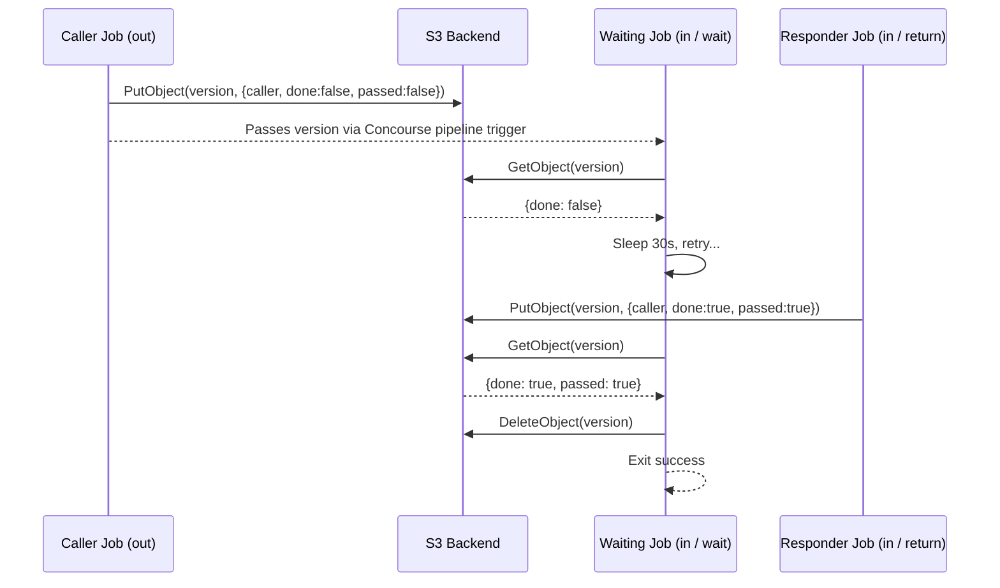

# Architecture Overview

Shuttle Resource is a [Concourse CI](https://concourse-ci.org/) custom resource type that enables coordinated communication between pipeline jobs. It acts as a signaling mechanism: one job initiates a "shuttle" and another job waits for a response, allowing asynchronous handoffs within and across pipelines.

---

## Core Concepts

### Resource Types in Concourse

Concourse models CI/CD workflows as pipelines composed of jobs, and jobs interact with external systems through resource types. A resource type defines three executables placed at `/opt/resource/`:

| Executable | Purpose |
|------------|---------|
| `check`    | Detects new versions of the resource |
| `in`       | Retrieves a specific version (get step) |
| `out`      | Produces a new version (put step) |

Shuttle Resource implements all three, with S3 as the durable storage layer.

---

### The Shuttle Pattern

The core workflow is a two-phase handshake:

1. **Caller job** (`out` step): Creates a new version in S3, stamping it with the job's identity. This version acts as a "ticket."
2. **Waiting job** (`in` step with `wait: true`): Polls S3 until the ticket is marked as done, then reads the result (pass or fail).
3. **Responding job** (`in` step with `return: true`): Marks the ticket as done and sets the pass/fail state.

This pattern is useful for coordinating across pipeline boundaries, triggering external processes, and collecting async results.

---

### Versioning

Versions are Unix nanosecond timestamps represented as 64-bit integers. The `check` executable lists all version objects in the configured S3 path and returns any versions newer than the one Concourse currently holds. If `seed_version` is enabled in the source configuration, version `1` is injected as a bootstrap version to trigger the pipeline on first run.

---

### Storage Layout

All data is stored as JSON objects in S3. Each version maps to a single object:

```
<path>/<version-number>
```

The object contains a JSON payload with the following fields:

| Field    | Type    | Description |
|----------|---------|-------------|
| `caller` | string  | Identity of the originating job (`team/pipeline/job:build`) |
| `done`   | boolean | Whether the shuttle has been responded to |
| `passed` | boolean | Whether the remote job reported success |

---

### Operation Modes

The `in` executable supports four modes, controlled by parameters:

| Mode     | Parameter       | Behavior |
|----------|----------------|---------|
| Get      | _(default)_    | Reads the payload without modification |
| Wait     | `wait: true`   | Polls until `done` is true, then cleans up the S3 object |
| Return   | `return: true` | Marks the payload as done; optionally sets `fail: true` |
| Skip     | `skip: true`   | No-op; immediately emits output without touching S3 |

---

## System Diagram

The following diagram illustrates a typical shuttle handshake between two Concourse jobs:



---

## Component Reference

### `driver` Package

Defines the `Driver` interface and its S3 implementation. The interface is kept deliberately minimal:

```go
type Driver interface {
    Read(version models.Version) (*models.Payload, error)
    Write(version models.Version, payload models.Payload) error
    Versions() (models.VersionList, error)
    Clean(version models.Version) error
}
```

All S3 interaction goes through `driver/s3.go`. Adding a new backend means implementing this interface.

### `models` Package

Defines the three core data types:

- `Version` — a typed `int64` with JSON marshalling
- `Payload` — the data stored per version (`caller`, `done`, `passed`)
- `Source` — the resource source configuration

### `utils` Package

Provides logging (`Log`), fatal exit (`Bail`), and job identity resolution (`CallerName`) using Concourse-injected environment variables.

---

For more information on adding new backends, see [extending.md](./extending.md).  
For pipeline configuration examples, see [examples.md](./examples.md).
